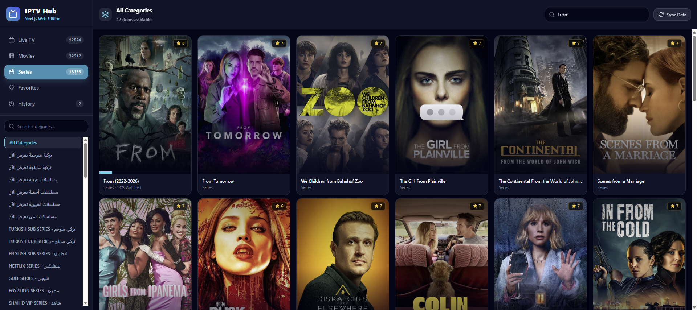
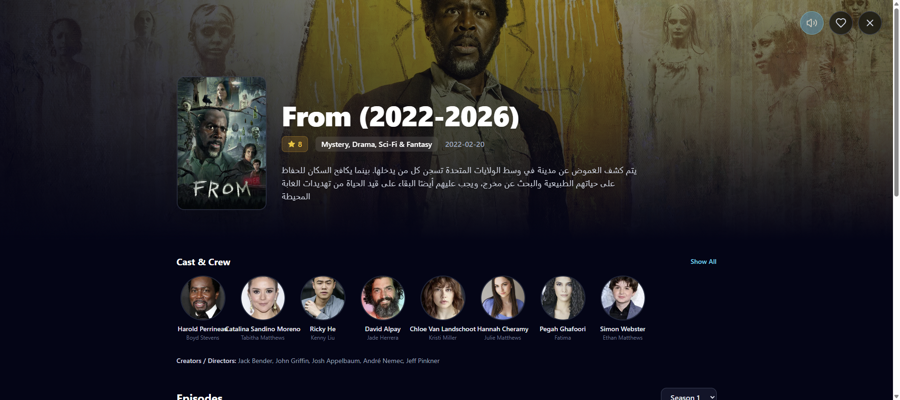

# Next.js IPTV Player

A premium, full-stack Next.js web application for streaming IPTV catalogs. It features a stunning cinematic UI, smart metadata fallback via TMDB, Plex Theme Songs, Intro skips via TheIntroDB, and high-performance virtualized lists.

## Features
- **Cinematic UI**: Full-screen modal overlays, gorgeous gradients, and a sleek dark mode.
- **Smart Metadata Fallback**: Automatically discovers and fills missing TMDB metadata (cast, plots, thumbnails) for VODs and Series.
- **Intro & Recap Skips**: Fully integrated with `TheIntroDB v3` to automatically skip intros, recaps, and outros!
- **Plex Theme Songs**: Seamlessly plays iconic theme songs when browsing series.
- **Virtualized Lists**: Engineered to render catalogs with tens of thousands of streams without stuttering or crashing.
- **Secure Server Proxy**: Safely proxies the Xtream Codes API calls server-side, protecting your credentials.

## Screenshots

### Dashboard


### Series Cinematic View


## Getting Started

1. Add your `.env.local` file with your Xtream Codes credentials and TMDB API key:
```env
XTREAM_HOST=your_host:port
XTREAM_USERNAME=your_username
XTREAM_PASSWORD=your_password
TMDB_API_KEY=your_tmdb_api_key
```

2. Install dependencies:
```bash
npm install
```

3. Run the development server:
```bash
npm run dev
```

4. Open [http://localhost:3000](http://localhost:3000) with your browser.

## Tech Stack
- Next.js 14 (App Router)
- React
- TailwindCSS
- Lucide Icons
- `@tanstack/react-virtual`
